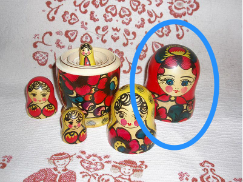

!SLIDE

# Ruby Concepts

!SLIDE quote

## `respond_to?`

"abc".respond_to? :empty?

!SLIDE quote

## `methods`

"abc".methods.sort

## 

"abc".methods.grep /empty\?/

!SLIDE quote

## What is the difference between these two?

"abc".respond_to? :empty? # => true

## 

String.respond_to? :empty # => false

!SLIDE quote

## `instance_methods`

String.instance_methods

    @@@ Ruby
    "abc".methods == String.instance_methods

!SLIDE quote

## Open Classes
    
    @@@ Ruby
    class String
      def to_vhs
        "vhs:#{self}"
      end
      
      def to_betamax
        "beta:#{self}"
      end
    end
    
    "abc".respond_to? :to_vhs
    String.instance_methods.
                        include? :to_betamax

!SLIDE quote
  
## Optional Parameters
    
    @@@ Ruby
    class String
      def empty?(ignore_whitespace = false)
        
        if ignore_whitespace
          self.strip == ""
        else
          self == ""
        end
        
      end
    end
  
    
!SLIDE quote

## Module is for Sharing!
    
    @@@ Ruby
    module VideoFormats
      def to_vhs ; "vhs:#{self}" ; end
      def to_betamax ; "beta:#{self}" ; end
    end
    
    class String
      include VideoFormats
    end

!SLIDE quote

## However, this does not work!
    
    @@@ Ruby
    module Overrides
      def empty?
        strip != ""
      end
    end
    
    class String
      include Overrides
    end

!SLIDE quote

## Module is for Caring!

    @@@ Ruby
    module UWRuby
      module VideoFormats
        def to_vhs ; "vhs:#{self}" ; end
        def to_betamax ; "beta:#{self}" ; end
      end
    
      class String < ::String
        include VideoFormats
      end
      
      String.new("abc").to_vhs
      String.instance_methods.include?(:to_vhs)
      ::String.new.respond_to?(:to_vhs)
    end

!SLIDE quote

# What the hell is `::`?
    
    @@@ Ruby
    module UWRuby
      #...
      class String < ::String
        include VideoFormats
      end
      #...
      ::String.new.respond_to?(:to_vhs)
    end

!SLIDE quote

## Prefixing a Constant

::String

!SLIDE quote

## ::String

!SLIDE quote

## Module is for Namespacing!
    
    @@@ Ruby
    module UWRuby
      module VideoFormats ; end
      class String ; end
    end

    String.instance_methods.include?(:to_vhs)
    UWRuby::String.new.respond_to?(:to_vhs)

!SLIDE quote

# I saw `::` again?

!SLIDE quote

## Between Constants
    @@@ Ruby
    UWRuby::String.new.respond_to?(:to_vhs)

## Equivalency

    @@@ Ruby
    module UWRuby
      String.new.respond_to?(:to_vhs)
    end

!SLIDE quote

## UWRuby::String

!SLIDE quote

## Salute to the `Kernel` Module

Gives you methods like `puts`, `warn`, `exit`, `raise`, and `fail`

!SLIDE quote

## Exceptional Ruby

An elegant way to fail!
    
    @@@ Ruby
    if $DEBUG
      module Kernel
        def warn(message) 
          raise message
        end 
      end
    end
    
!SLIDE

## Around Alias

    @@@ Ruby
    class String
      alias :old_reverse :reverse

      def reverse
        "[#{old_reverse}]"
      end

    end
    
    "abc".reverse
    "abc".old_reverse

!SLIDE

## Around Alias
    
    @@@ Ruby
    class String
      alias_method :old_reverse, :reverse

      def reverse
        "[#{old_reverse}]"
      end

    end

    "abc".reverse
    "abc".old_reverse
